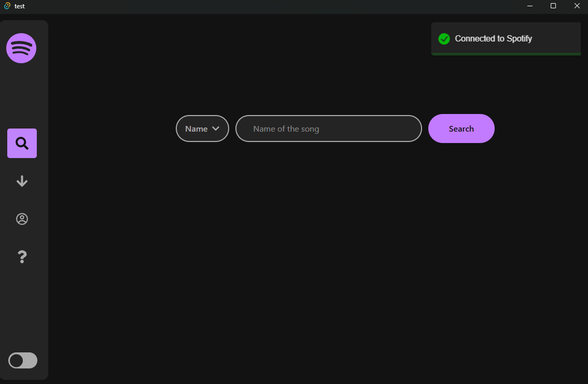
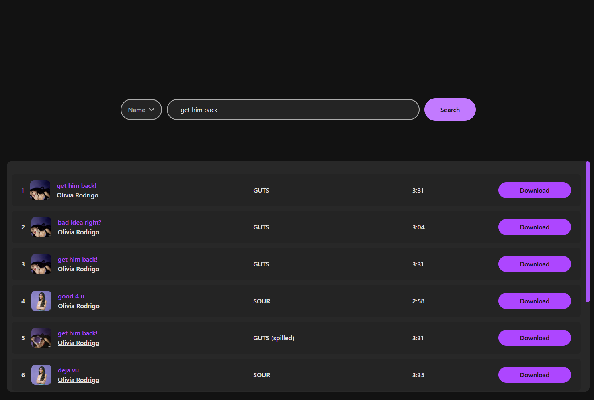
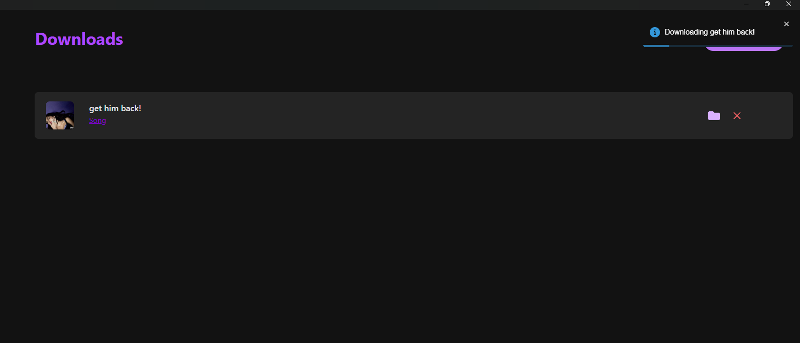
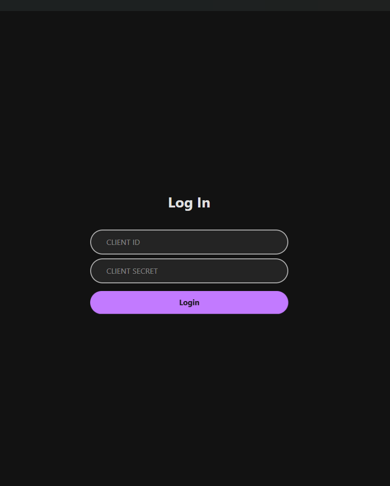

# SPOTIPOOP

Introducing spotipoop the ultimate non premium commitment because I can't keep up with the fucking prices. Another company raised their prices again? Removed features? Too bad! Just download your whole library offline with Spotipoop.

## How it works?

Search a song and download it. Need a playlist? Just make your playlist public and paste its link into the search bar and download everything easily.

## Project structure 

Frontend in tauri so super compact, super fast. No memory hogging electron.
Backend in python no Flask just simple IPC with std I/O JSON parsing.

## Screenshots

## Contributing

**Please don't.**